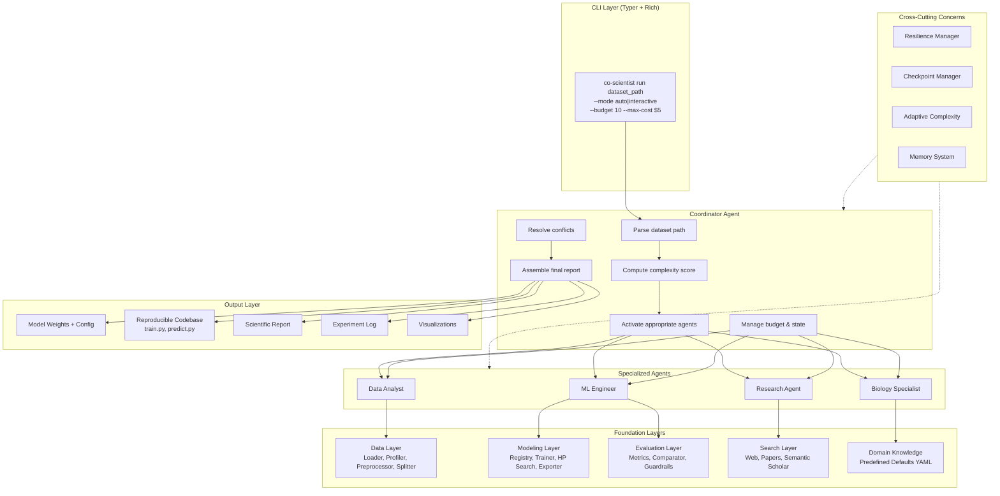
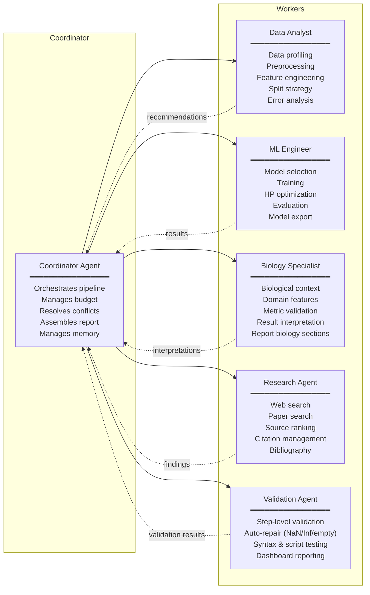
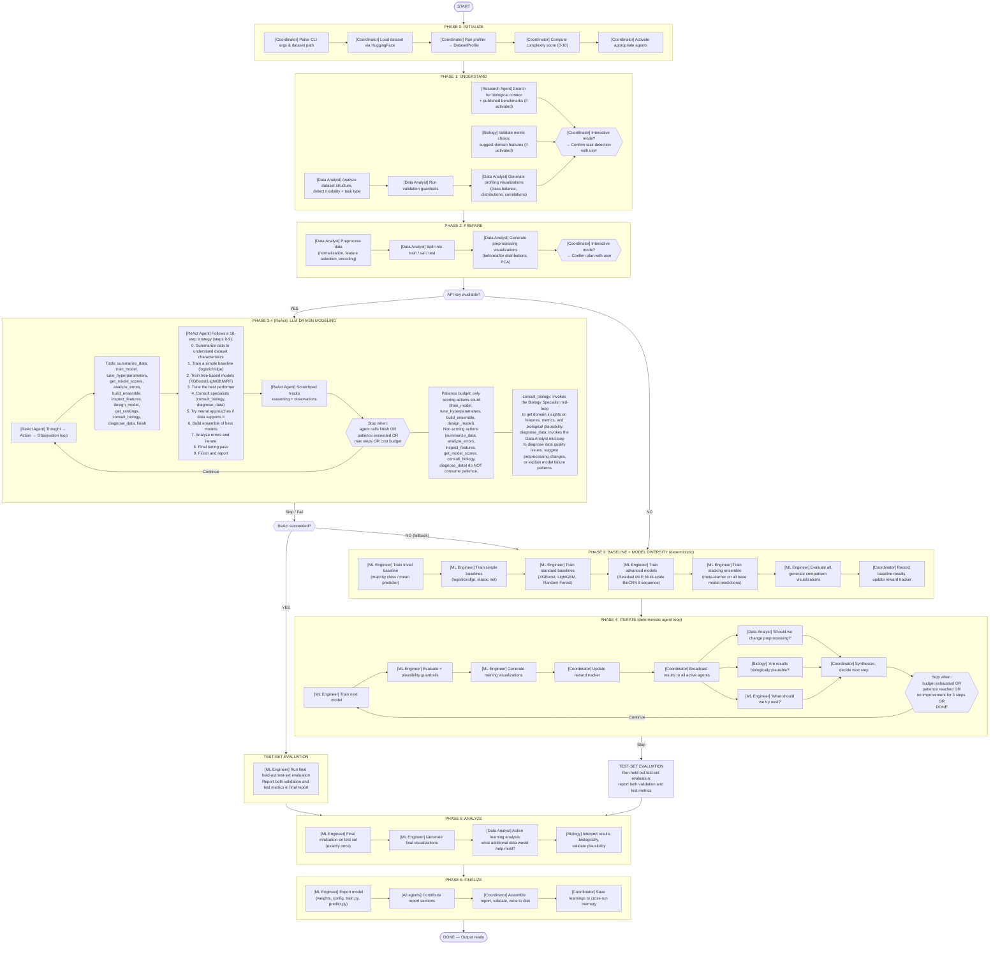

# AIDO Co-Scientist — Architecture & Design Document

## Table of Contents

1. [Overview](#1-overview)
2. [Related Work & What We Adopt](#2-related-work--what-we-adopt)
3. [System Architecture](#3-system-architecture)
4. [Multi-Agent Design](#4-multi-agent-design)
5. [Pipeline Flow (Step-by-Step)](#5-pipeline-flow-step-by-step)
6. [Data Layer](#6-data-layer)
7. [Modeling Layer](#7-modeling-layer)
8. [Evaluation Layer](#8-evaluation-layer)
9. [Search & Research Layer](#9-search--research-layer)
10. [Resilience & Guardrails](#10-resilience--guardrails)
11. [CLI & User Experience](#11-cli--user-experience)
12. [Deliverables & Output Structure](#12-deliverables--output-structure)
13. [Technology Stack](#13-technology-stack)
14. [Deployment & GPU Setup](#14-deployment--gpu-setup)

---

## 1. Overview

The AIDO Co-Scientist is a **CLI-based multi-agent system** that automates building ML models for biological datasets from the [genbio-leaderboard](https://huggingface.co/genbio-ai). Given a dataset path, it produces:

1. A **performant ML model** (with saved weights)
2. A **portable, reproducible codebase** (`train.py`, `predict.py`, `requirements.txt`)
3. A **scientific report** summarizing the process and findings

It operates in two modes:
- **Interactive** — pauses at decision points for user input
- **Autonomous** — makes all decisions independently

Core design principle: **graceful degradation** — the system always produces output, even when components fail.

---

## 2. Related Work & What We Adopt

### 2.1 Google DeepMind — "Towards an AI Co-Scientist" (Feb 2025)

**Paper:** [arXiv:2502.18864](https://arxiv.org/abs/2502.18864)

A multi-agent system built on Gemini 2.0 for scientific hypothesis generation. Uses a Supervisor agent + 6 specialized agents (Generation, Reflection, Ranking, Evolution, Proximity, Meta-review).

**Key innovations:**
- Tournament-based hypothesis ranking with Elo ratings
- Generate → Debate → Evolve loop inspired by the scientific method
- Test-time compute scaling (more reasoning = better hypotheses)
- Asynchronous task execution for flexible compute allocation

**What we adopt:**
- **Multi-agent with supervisor pattern** — Our Coordinator agent mirrors their Supervisor, orchestrating specialized worker agents
- **Iterative refinement loop** — Our Phase 4 (ITERATE) is analogous to their evolution cycle, where each model iteration is informed by feedback from all active agents
- **Test-time compute scaling** — Our adaptive complexity system scales agent activation and iteration depth based on dataset difficulty (same principle, applied to ML pipelines instead of hypothesis generation)

**What we also adopt (directly from paper):**
- **Tournament-style model ranking** — In Phase 4 (ITERATE), instead of trying models sequentially, the ML Engineer proposes 2-3 candidate strategies per iteration. These compete head-to-head on the validation set, and we maintain an Elo-style ranking to track which *approaches* (not just models) perform best. This prevents the system from getting stuck in local optima.
- **Agent debate before decisions** — Before the Coordinator commits to a major decision (e.g., "switch preprocessing" or "try neural network"), the Data Analyst and ML Engineer present competing arguments. The Coordinator resolves based on evidence strength. This mirrors Google's generate-debate-evolve loop applied to ML strategy decisions.

**What we do differently:**
- **Domain-specialized agents vs. cognitive-function agents** — Google's agents are specialized by *thinking style* (generate, reflect, rank). Ours are specialized by *domain role* (Data Analyst, ML Engineer, Biology Specialist). This is more appropriate for structured ML pipeline construction where domain knowledge matters more than abstract reasoning chains.
- **Concrete, measurable outputs** — Google's system produces hypotheses (text). Ours produces models, code, and reports (artifacts). This requires a more structured pipeline with explicit phases.

### 2.2 Sakana AI — "The AI Scientist" (Aug 2024, v2 Apr 2025)

**Paper:** [arXiv:2408.06292](https://arxiv.org/abs/2408.06292) (v1), [arXiv:2504.08066](https://arxiv.org/abs/2504.08066) (v2)

End-to-end automated scientific discovery: idea generation → code implementation → experiment execution → paper writing → automated peer review. v2 uses agentic tree search and produced the first AI-generated paper accepted at an ICLR 2025 workshop.

**Key innovations:**
- Full pipeline automation at ~$15/paper
- Agentic tree search for experiment planning (v2)
- Automated peer review as quality filter
- VLM-based figure evaluation

**What we adopt:**
- **Full pipeline automation** — Our system similarly covers the entire lifecycle: data profiling → preprocessing → modeling → evaluation → report generation
- **Automated quality checks** — Our guardrail system (Section 10) catches errors before they reach the final output, with 5 categories of scientific validation
- **Visualization-informed decisions** — Like their VLM figure evaluation, our system generates visualizations at each stage and feeds structured insights back into the LLM's reasoning

**What we also adopt (directly from paper):**
- **Agentic tree search for experiment planning** — Instead of a purely linear iterate loop, Phase 4 maintains a lightweight *experiment tree*. When the ML Engineer proposes a model, it can branch into parallel paths (e.g., "XGBoost + HP tuning" vs. "XGBoost + different features"). If one branch dead-ends (no improvement for 2 steps), the system backtracks and explores the other. This is a simplified version of Sakana v2's tree search, adapted from paper generation to model selection.
- **Biology-informed performance context** — The report includes a "Performance Context" section where the Biology Specialist's assessment (plausibility, expected score ranges from literature, biological signals) is rendered alongside the model's validation and test scores, giving readers immediate context for interpreting results.

**What we do differently:**
- **LLM-as-strategist, not executor** — Sakana's system has the LLM write and execute arbitrary code, which led to a 42% experiment failure rate ([evaluation paper](https://arxiv.org/abs/2502.14297)). Our system has the LLM make *decisions* (which model, which preprocessing, which hyperparameters) while execution is handled by deterministic, pre-built code paths. This is more reliable and reproducible.
- **Human-in-the-loop option** — Sakana's system is fully autonomous. We provide both autonomous and interactive modes, reflecting the lesson that co-scientist framing outperforms full autonomy in practice.
- **Biology-specific** — Sakana targets general ML research. We are purpose-built for biological datasets with domain-specific preprocessing, metrics, and interpretation.

### 2.3 CellAgent — Multi-Agent for Single-Cell Analysis (ICLR 2025)

**Paper:** [arXiv:2407.09811](https://arxiv.org/abs/2407.09811)

An LLM-driven multi-agent framework for automated scRNA-seq analysis with Planner/Executor/Evaluator roles. Achieved ~60% efficiency improvement over human experts.

**What we adopt:**
- **Planner/Executor/Evaluator separation** — Maps to our Coordinator (planner) + ML Engineer (executor) + Data Analyst/Biology Specialist (evaluators)
- **Domain-specific toolkit** — CellAgent's sc-Omni toolkit for single-cell analysis is analogous to our predefined defaults registry and modality-specific preprocessing pipelines
- **Self-iterative optimization** — Their autonomous refinement loop based on evaluation feedback mirrors our Phase 4 iterate loop

**What we also adopt (directly from paper):**
- **Error-feedback self-correction** — When training fails or produces implausible results, CellAgent feeds the *exact error message and context* back to the executor agent for intelligent recovery. We adopt this: instead of just "retry with fallback config," the ML Engineer receives the full error trace + the Data Analyst's diagnosis of what likely went wrong, enabling targeted fixes (e.g., "OOM → reduce batch size from 64 to 16" rather than "OOM → try a different model").
- **Expert-curated toolkit pattern** — CellAgent's sc-Omni bundles vetted tools for each analysis step. Our predefined defaults registry serves the same role: curated YAML configs per modality/task/dataset ensure the system makes sensible choices even without LLM reasoning.

**What we do differently:**
- **Broader scope** — CellAgent is scRNA-seq only. We handle DNA, RNA, protein, cell expression, spatial transcriptomics, and multimodal data.
- **More agents with finer specialization** — CellAgent uses 3 roles. We use 5 agents with distinct tool sets, allowing more nuanced collaboration (e.g., Biology Specialist can suggest features the ML Engineer wouldn't think of).

### 2.4 GenBio AI — AIDO Foundation Models (Dec 2024)

**Paper:** [arXiv:2412.06993](https://arxiv.org/abs/2412.06993)

The AIDO stack provides multiscale biological foundation models (AIDO.DNA, AIDO.RNA, AIDO.Protein, AIDO.Cell, AIDO.Tissue) that serve as the biological backbone our co-scientist builds upon.

**What we adopt:**
- **Foundation model embeddings as features** — Our "Foundation" tier in the model registry uses AIDO model embeddings as input features for downstream classifiers/regressors
- **Compute-once embedding cache** — FM embeddings are expensive. Following AIDO's pattern, we compute embeddings *once* per dataset and cache them to disk. All downstream models (classifier head tuning, XGBoost on embeddings, etc.) reuse the cached embeddings. This avoids redundant GPU computation across iterations.
- **Modality-specific pipelines** — AIDO's per-modality model architecture informs our preprocessing and model candidate selection per data type
- **ModelGenerator patterns** — AIDO.ModelGenerator's declarative recipe system influenced our predefined defaults registry design

### 2.5 Summary: What Comes From Where

```
┌──────────────────────────────┬──────────────────────────────────────────────┐
│ Design Element               │ Source                                       │
├──────────────────────────────┼──────────────────────────────────────────────┤
│ Multi-agent + Supervisor     │ Google AI Co-Scientist, CellAgent            │
│ Tournament model ranking     │ Google AI Co-Scientist (Elo ratings)         │
│ Agent debate before decisions│ Google AI Co-Scientist (generate-debate)     │
│ Adaptive complexity          │ Google (test-time compute scaling)           │
│ Experiment tree search       │ Sakana AI Scientist v2 (agentic tree search)│
│ Biology-informed reporting    │ Novel — domain expert context in reports     │
│ LLM-as-strategist            │ Lesson from Sakana 42% failure rate          │
│ Error-feedback self-correction│ CellAgent (self-iterative optimization)    │
│ Expert-curated toolkit/YAML  │ CellAgent (sc-Omni), AIDO (ModelGenerator)  │
│ FM embedding cache           │ AIDO (compute-once, reuse across models)    │
│ Iterative refinement loop    │ Google (evolve), CellAgent (self-optimize)  │
│ Graceful degradation         │ Novel — production engineering principle     │
│ Active learning analysis     │ Novel — connects ML to GenBio virtual lab   │
│ Biology Specialist agent     │ CellAgent (domain expertise) + Novel        │
│ Cross-run memory             │ Novel                                        │
│ Visualization-informed LLM   │ Sakana v2 (VLM figures) + Novel             │
└──────────────────────────────┴──────────────────────────────────────────────┘
```

---

## 3. System Architecture

### High-Level Flowchart



### Inter-Agent Communication

All agents communicate through **structured messages**, not free text:

```
AgentMessage:
  from_agent: str
  to_agent: str
  message_type: "recommendation" | "result" | "question" | "override"
  content:
    summary: str              # one-line natural language
    structured_data: dict     # machine-readable payload
    confidence: float         # 0-1
    evidence: list[str]       # citations or data points
```

All messages are routed through the Coordinator, which enables:
- Cost control and audit logging
- Deduplication of research requests
- Conflict detection between agents

---

## 4. Multi-Agent Design

### 4.1 Agent Roles



### 4.2 Adaptive Complexity

Not every dataset needs all 6 agents. The Validation Agent is always active; the remaining agents are scaled by a complexity score (0-10) computed from the dataset profile:

| Complexity | Score | Active Agents | Search Budget | Iteration Steps | HP Trials |
|---|---|---|---|---|---|
| Simple | 0-2 | Coordinator + Data Analyst + ML Engineer | 0 (defaults) | 4 | 10 |
| Moderate | 3-5 | Above + Research (lite) | 3 web | 6 | 20 |
| Complex | 6-8 | All five | 6 web + 3 paper | 10 | 30 |
| Very Complex | 9-10 | All five (deep) | 10 web + 6 paper | 15 | 50 |

**Dynamic escalation:** If results are unexpectedly poor (model barely beats baseline), the Coordinator can escalate mid-run — activating dormant agents without restarting.

### 4.3 Implementation

All agents are the same Claude model with different system prompts and tool sets:

```python
class Agent:
    def __init__(self, name, system_prompt, tools):
        self.name = name
        self.system_prompt = system_prompt
        self.tools = tools              # only this agent's tools
        self.memory = AgentMemory()

class Coordinator:
    def __init__(self):
        self.agents = {
            "data_analyst": Agent("data_analyst", DATA_ANALYST_PROMPT, DATA_TOOLS),
            "ml_engineer":  Agent("ml_engineer", ML_ENGINEER_PROMPT, ML_TOOLS),
            "biology":      Agent("biology", BIOLOGY_PROMPT, BIOLOGY_TOOLS),
            "research":     Agent("research", RESEARCH_PROMPT, RESEARCH_TOOLS),
            "validation":   Agent("validation", VALIDATION_PROMPT, VALIDATION_TOOLS),
        }
```

---

## 5. Pipeline Flow (Step-by-Step)

### Complete Pipeline Flowchart



### Step-by-Step Walkthrough

#### Phase 0: Initialize
1. Parse CLI arguments (`dataset_path`, `--mode`, `--budget`, `--max-cost`, `--resume`)
2. Load dataset from genbio-leaderboard via HuggingFace `datasets` library
3. Run the **Profiler** — produces a `DatasetProfile` (num_samples, num_features, class_distribution, missing_value_pct, sequence_length_stats, detected_issues) entirely without LLM involvement
4. Compute **complexity score** (0-10) from the profile
5. Activate the appropriate agents based on complexity

#### Phase 1: Understand
6. **Data Analyst** analyzes the dataset: detects modality (RNA sequence, cell expression, protein, etc.) using a cascade — path parsing → column names → content inspection → dimensionality patterns → HuggingFace metadata
7. **Data Analyst** runs validation guardrails: data loads, expected columns exist, target is not constant, feature matrix is not all zeros/NaN
7a. **Validation Agent** runs post-load and post-profile validation with auto-repair (NaN/Inf replacement, empty data recovery) — see Section 10.6
8. **Data Analyst** generates profiling visualizations (target distribution, class balance chart, UMAP/t-SNE, missing value heatmap, sequence length distribution)
9. **Research Agent** (if activated) searches for biological context and published benchmarks
10. **Biology Specialist** (if activated) validates metric choice and suggests domain-specific features
11. In **interactive mode**: Coordinator presents findings and confirms task detection with user

#### Phase 2: Prepare
12. **Data Analyst** applies modality-specific preprocessing:
    - Expression data: log1p normalization, HVG selection, standard/robust scaling, PCA
    - Sequence data: tokenization (k-mer, BPE, single-nucleotide), codon usage features, k-mer frequencies
    - Protein data: amino acid composition, physicochemical properties, BLOSUM features
    - General: label encoding, class weighting, SMOTE for minority classes
13. **Data Analyst** splits data — uses predefined splits if available, falls back to stratified (classification) or random (regression) with 70/15/15 ratio
13a. **Validation Agent** runs post-preprocessing validation with auto-repair (empty split carving, NaN/Inf cleanup) — see Section 10.6
14. Generates preprocessing visualizations (before/after distributions, PCA variance explained, split distribution verification)
15. In **interactive mode**: Coordinator confirms preprocessing plan with user

#### Phase 3: Baseline + Model Diversity
16. **ML Engineer** trains **trivial baseline** (majority class / mean predictor) — establishes the floor
17. **ML Engineer** trains **simple baselines** (logistic/ridge regression, elastic net) — tests linear signal
18. **ML Engineer** trains **standard baselines** (XGBoost, LightGBM, Random Forest) — three diverse tree ensembles
19. **ML Engineer** trains **advanced models** (Residual MLP for tabular; Multi-scale BioCNN for sequence data)
20. **ML Engineer** trains **stacking ensemble** — meta-learner on out-of-fold predictions from all base models
21. **ML Engineer** evaluates all, generates comparison bar charts
22. **Coordinator** records results in the reward tracker

#### Phase 4: Iterate (the agent loop — with tree search & tournament ranking)

This phase adopts two key mechanisms from the literature:
- **Experiment tree search** (from Sakana v2): Instead of a linear sequence of experiments, the system maintains a tree of experiment paths. When a branch stalls (no improvement for 2 steps), it backtracks and explores alternatives.
- **Tournament ranking** (from Google AI Co-Scientist): When the ML Engineer proposes multiple candidate strategies, they compete head-to-head and are ranked via Elo ratings. This ranks *approaches* (not just final scores), so the system learns which *types* of interventions work for this dataset.

21. **ML Engineer** proposes 2-3 candidate strategies based on results so far (e.g., "HP-tune current best" vs. "try MLP" vs. "add feature engineering")
22. **Coordinator** runs candidates in parallel (or sequentially if resource-constrained)
23. **ML Engineer** evaluates each with plausibility guardrails:
    - Perfect score (1.0) → WARNING: data leakage
    - Worse than trivial baseline → WARNING: something broken
    - All predictions identical → ERROR: model collapsed
    - Train-val gap > 0.3 → WARNING: overfitting
24. **Coordinator** updates tournament Elo rankings and broadcasts results to all active agents
25. **Agent debate round** — before committing to next step:
    - **Data Analyst** argues: "Should we change preprocessing?" (with evidence)
    - **Biology Specialist** argues: "Are results biologically plausible?" (with evidence)
    - **ML Engineer** argues: "What should we try next?" (with evidence)
    - If agents disagree, Coordinator weighs evidence and confidence scores to resolve

> **Pre-ReAct debate:** When the ReAct agent path is active, ML Engineer and Data Analyst debate modeling strategy *before* the ReAct loop starts (in `cli.py`, before `run_react_modeling()`). Proposals, rebuttals, and the judge verdict appear in the Agent Conversations dashboard panel. This ensures adversarial reasoning informs the agent's initial strategy rather than being limited to the deterministic path.

> **Debate decision points:** Debate now occurs at **4 decision points**: (1) preprocessing strategy, (2) modeling strategy, (3) model selection, and (4) HP search strategy. A **budget reservation** of $0.10 is set aside to ensure post-ReAct debates (e.g., model selection, HP search) are not starved of budget. When the debate mechanism fails (e.g., budget too low or agent error), it **falls back to consult** — this fallback is logged and visible in the dashboard Agent Conversations panel.
>
> **File:** `co_scientist/agents/coordinator.py`
26. **Coordinator** synthesizes, decides next step, and updates the experiment tree:
    - If current branch is improving → continue deeper
    - If current branch stalled (no improvement for 2 steps) → backtrack, explore alternative branch
    - If a previously unexplored branch looks promising based on new evidence → pivot
27. **Repeat** until: budget exhausted, patience reached, no improvement across all branches for 3 steps, or satisfactory result achieved

#### Phase 5: Analyze
29. **ML Engineer** runs final evaluation on test set — **exactly once** (scientific integrity)
30. **ML Engineer** generates final visualizations (confusion matrix, feature importance, residual plots)
31. **Data Analyst** runs **active learning analysis**:
    - Class-level data need: which classes bottleneck performance? How many more samples needed?
    - Uncertainty-based prioritization: which samples is the model most uncertain about?
32. **Biology Specialist** runs **feature gap analysis**: what new *types of data* (not just more samples) would help?
33. **Biology Specialist** interprets results biologically

#### Phase 6: Finalize
34. **ML Engineer** exports the best model: weights (.pkl/.pt), config (JSON), `train.py`, `predict.py`, `requirements.txt`, `README.md`
34a. **Validation Agent** validates exported scripts — `train.py` is parsed with `ast.parse` for syntax correctness, then **actually executed in a subprocess** to verify it runs end-to-end. Failures trigger auto-repair (syntax fix → LLM fix → retry) — see Section 10.6
35. **All agents** contribute their report sections
36. **Coordinator** assembles the final scientific report
37. **Biology Specialist** contributes performance context — plausibility assessment, expected score ranges from literature, and biological signal interpretation are embedded in the report
38. **Coordinator** saves learnings to cross-run memory for future datasets

---

## 6. Data Layer

### 6.1 Dataset Loading
Loads from genbio-leaderboard via HuggingFace `datasets` library. Detects format (parquet, CSV, HF dataset) and standardizes into a common internal representation.

### 6.2 Profiler
Produces a structured `DatasetProfile` **without any LLM involvement**:

```
DatasetProfile:
  dataset_name, task_hint (from path), input_type, target_column, target_type,
  num_samples, num_features, num_classes, class_distribution, missing_value_pct,
  feature_sparsity, sample_to_feature_ratio, sequence_length_stats, detected_issues
```

### 6.3 Modality Detection & Routing

Identifies data type using a cascade:

```
path parsing → column names → content inspection → dimensionality patterns → HF metadata
```

Supports: DNA sequences, RNA sequences, protein sequences, cell/scRNA-seq expression, spatial transcriptomics, and multimodal combinations.

### 6.4 Modality-Specific Preprocessing

| Modality | Preprocessing | Baselines | Advanced |
|---|---|---|---|
| DNA sequences | k-mer tokenization, GC content | XGBoost on k-mers | 1D-CNN, AIDO.DNA embeddings |
| RNA sequences | codon-aware tokenization, UTR features | Ridge/XGBoost on codon usage | AIDO.RNA/CDS embeddings |
| Protein sequences | AA composition, physicochemical features | XGBoost on composition | ESM2, AIDO.Protein embeddings |
| Cell/scRNA-seq | log1p, HVG selection, scaling | Logistic/XGBoost on HVGs | AIDO.Cell, Geneformer embeddings |
| Spatial | scRNA-seq pipeline + spatial features | XGBoost ignoring spatial | GNN, AIDO.Tissue embeddings |
| Multimodal | Per-modality processing + fusion | Ensemble | Intermediate embedding fusion |

### 6.5 Splitting Strategy
1. Use predefined splits if available in the dataset
2. Fall back to stratified splitting (classification) or random splitting (regression)
3. 70/15/15 ratio (train/val/test)
4. Verify splits are disjoint

---

## 7. Modeling Layer

### 7.1 Model Registry

Models are organized in tiers, tried bottom-up. The system builds diversity across model families — linear, tree-based, neural, and ensemble — to avoid over-reliance on any single approach.

| Tier | Classification | Regression | Notes |
|---|---|---|---|
| **Trivial** | Majority class | Mean predictor | Floor baseline — every model must beat this |
| **Simple** | Logistic regression, Elastic Net | Ridge regression, Elastic Net | Linear baselines — test if features have signal |
| **Standard** | XGBoost, LightGBM, Random Forest | XGBoost, LightGBM, Random Forest | Three diverse tree ensembles with different inductive biases |
| **Advanced** | MLP, BioCNN, FT-Transformer, LLM-designed custom models | MLP, BioCNN, FT-Transformer, LLM-designed custom models | Custom architectures — see §7.4 and §7.5; FT-Transformer included for RNA/protein data |
| **Ensemble** | Stacking meta-learner | Stacking meta-learner | Combines all base models — see §7.6 |
| **Foundation** | FM embeddings + classifier | FM embeddings + regressor | AIDO model embeddings — requires GPU (see §7.7) |

**Candidate filtering** removes invalid options before training (e.g., no sequence models for tabular data, no large models for tiny datasets, BioCNN only for sequence modalities).

**Model-modality routing:**

| Modality | Models Used |
|---|---|
| RNA/DNA sequences | All linear + tree models on k-mer features, Multi-scale BioCNN on raw sequences, FT-Transformer, LLM-designed custom models, Stacking ensemble |
| Cell expression (tabular) | All linear + tree models, Residual MLP, Stacking ensemble (BioCNN skipped) |
| Protein sequences | All linear + tree models on AA features, Multi-scale BioCNN (adapted kernel sizes), FT-Transformer, LLM-designed custom models, Stacking |
| RNA/DNA + GPU | Above + embed_xgboost, embed_mlp (AIDO embeddings), concat_xgboost, concat_mlp (k-mers + embeddings), aido_finetune (end-to-end) |
| Cell expression + GPU | Above + embed_xgboost, embed_mlp (AIDO.Cell embeddings), concat_xgboost, concat_mlp (HVG + embeddings) |
| Protein + GPU | Above + embed_xgboost, embed_mlp (AIDO.Protein embeddings), concat_xgboost, concat_mlp (AA + embeddings), aido_finetune |

### 7.2 Hyperparameter Search
- **Engine:** Optuna (Bayesian optimization with pruning)
- **Budget:** Scales with complexity (10-50 trials)
- **Search space:** Defined per model type in defaults YAML; LLM can refine in Phase D
- **Searchable models:** XGBoost, LightGBM, Random Forest, MLP, BioCNN — all have defined search spaces

### 7.3 Model Export

Produces a fully portable package:
- Model weights (`.pkl`, `.pt`, or `.json`)
- Config file (all hyperparameters, preprocessing, random seed)
- `train.py` — reproduces training without the co-scientist
- `predict.py` — inference on new data (`python predict.py --input new_data.csv`)
- `requirements.txt` — pinned dependencies
- `README.md` — how to install, train, and predict

### 7.4 Custom Architecture: Multi-Scale BioCNN

A custom 1D convolutional neural network designed for biological sequences. Unlike a standard 1D CNN with a single kernel size, the Multi-scale BioCNN uses **parallel convolutional branches** with different kernel sizes to capture biological motifs at multiple scales simultaneously.

**Architecture:**
```
Input (one-hot encoded sequence)
    │
    ├── Conv1D(kernel=3)  → captures codons, dinucleotide patterns
    ├── Conv1D(kernel=5)  → captures short motifs (splice sites, start codons in context)
    ├── Conv1D(kernel=7)  → captures TF binding sites, kozak-like sequences
    └── Conv1D(kernel=9)  → captures longer regulatory elements
    │
    Concatenate all branch outputs
    │
    Global Average Pooling + Global Max Pooling (captures both average and peak signal)
    │
    FC layers with dropout + residual connection
    │
    Output (regression value or class logits)
```

**Design rationale:**
- Inspired by Inception-style networks, adapted for 1D biological sequences
- Each kernel size captures different biological feature scales
- Global pooling makes it length-invariant (handles variable-length sequences)
- Residual connections in FC layers prevent vanishing gradients
- Much lighter than a transformer — trainable on CPU with thousands of samples

**Hyperparameters:**
- `n_filters`: Number of filters per branch (default: 64)
- `kernel_sizes`: List of kernel sizes (default: [3, 5, 7, 9])
- `fc_dims`: FC layer dimensions (default: [256, 128])
- `dropout`: Dropout rate (default: 0.3)
- `max_epochs`, `patience`, `learning_rate`, `batch_size`

### 7.5 Custom Architecture: Residual MLP

An enhanced MLP with skip connections, designed for tabular data where standard MLPs often struggle against tree-based methods.

**Architecture:**
```
Input features
    │
    Linear → BatchNorm → ReLU → Dropout
    │                                │
    Linear → BatchNorm → ReLU       │ (skip connection)
    │                                │
    Add ←────────────────────────────┘
    │
    [Repeat for N residual blocks]
    │
    Linear → Output
```

**Design rationale:**
- Skip connections let the network learn residual improvements over identity
- BatchNorm stabilizes training on varied feature scales
- Competes with tree models on tabular data (addresses the known MLP-vs-trees gap)

### 7.6 Stacking Ensemble

The stacking ensemble is the system's key differentiator — it **builds a new model** by combining the predictions of all successfully trained base models.

**How it works:**
1. Train all base models (linear, tree, neural) on training data
2. Generate out-of-fold predictions from each base model using cross-validation
3. Train a meta-learner (Ridge/Logistic regression) on the stacked predictions
4. At inference: run all base models → feed predictions to meta-learner → final output

**Why this matters:**
- Each base model captures different patterns (linear relationships, non-linear interactions, sequence motifs)
- The meta-learner learns *which models to trust for which types of inputs*
- Typically outperforms any individual model by 2-5% on the primary metric
- This is genuinely "building a new model" — the ensemble is a novel model that didn't exist before

**Implementation details:**
- Uses `sklearn.model_selection.cross_val_predict` for out-of-fold predictions (avoids data leakage)
- Meta-learner is intentionally simple (Ridge/LogisticRegression) to avoid overfitting
- Falls back gracefully: if only 1-2 base models succeed, stacking still works (just less diverse)
- Exported as a single pickle containing all base models + meta-learner
- **Custom model export:** LLM-designed models (dynamically generated PyTorch classes) cannot be pickled normally. Instead, they are exported as `best_model.pt` (state dict) + `custom_model.py` (source code), enabling full reproducibility without pickle limitations

### 7.7 Foundation Tier: AIDO Embeddings (GPU Required)

When a CUDA-capable GPU is detected (`torch.cuda.is_available()`), the pipeline automatically enables a **foundation tier** that leverages pre-trained AIDO foundation models. On CPU, this tier is skipped entirely — the existing CPU pipeline runs unchanged.

**AIDO foundation models used:**

| Modality | Foundation Model | Config Key | HuggingFace Model Name |
|----------|-----------------|------------|------------------------|
| RNA sequences | AIDO.RNA-1.6B | `aido_rna_1b600m` | `genbio-ai/AIDO.RNA-1.6B` |
| DNA sequences | AIDO.DNA-300M | `aido_dna_300m` | `genbio-ai/AIDO.DNA` |
| Protein sequences | AIDO.Protein-16B | `aido_protein_16b` | `genbio-ai/AIDO.Protein` |
| Cell expression | AIDO.Cell-100M | `aido_cell_100m` | `genbio-ai/AIDO.Cell-100M` |

**GPU detection** (`modeling/foundation.py`):
```python
gpu_available() -> bool  # wraps torch.cuda.is_available()
should_use_foundation(modality, config) -> bool  # GPU + config + modality check
```
Called once at preprocessing time. Result gates foundation-tier model registration and embedding extraction.

**Embedding extraction** (`modeling/foundation.py::extract_embeddings`):
1. Load the appropriate AIDO model: `Embed.from_config({"model.backbone": model_name}).eval()`
2. Tokenize sequences via the model's transform pipeline: `model.transform({"sequences": batch})`
3. Run batched inference on GPU (`torch.no_grad()`, configurable batch size)
4. Handle multiple output formats (Tensor, dict with `embeddings`/`last_hidden_state`)
5. Mean-pool hidden states → numpy array of shape `(n_samples, embedding_dim)`
6. **Cache to disk** (`.npy` files keyed by data hash) — reruns skip extraction automatically

**Important API detail:** The `modelgenerator` library requires a two-step process — `model.transform()` tokenizes the input, then `model()` runs inference on the tokenized tensors. Passing raw strings directly to `model()` does not work.

**Memory management**: The AIDO model is freed from GPU memory after embedding extraction (`del model; torch.cuda.empty_cache()`), before downstream model training begins.

**Data flow**:
```
Raw sequences → AIDO model (GPU) → mean-pool → embeddings (numpy)
                                                      ↓
                                    Stored in PreprocessingResult.X_embed
                                                      ↓
                                    Split into SplitData.X_embed_{train,val,test}
                                                      ↓
                            Foundation-tier models train on embeddings
```

**Foundation-tier models (5 total):**

| Model | Type | Input | Key File |
|-------|------|-------|----------|
| `embed_xgboost` | Embedding-only | `X_embed_train` | `modeling/registry.py` |
| `embed_mlp` | Embedding-only | `X_embed_train` | `modeling/registry.py` |
| `concat_xgboost` | Hybrid | `hstack(X_train, X_embed_train)` | `modeling/registry.py` |
| `concat_mlp` | Hybrid | `hstack(X_train, X_embed_train)` | `modeling/registry.py` |
| `aido_finetune` | End-to-end | Raw sequences | `modeling/aido_finetune.py` |

**Routing logic** (in `modeling/trainer.py`):
- Embedding models (`embed_*`): `model.fit(split.X_embed_train, y_train)`
- Concat models (`concat_*`): `model.fit(np.hstack([split.X_train, split.X_embed_train]), y_train)`
- Fine-tune model: `model.fit(split.X_train, y_train, sequences=split.seqs_train)`

All wrappers are sklearn-compatible (`fit`/`predict`/`predict_proba`). The `TrainedModel` class exposes `needs_embeddings` and `needs_sequences` properties; the trainer, evaluator, and validation agent route data accordingly.

### 7.8 Foundation Tier: AIDO Fine-Tuning (GPU Required)

Beyond frozen embeddings, the pipeline can **fine-tune** the last few layers of the AIDO model end-to-end for the specific task. This typically yields the strongest performance.

**Architecture** (`modeling/aido_finetune.py`):
```
Input sequences → model.transform({"sequences": batch})  [tokenization]
    ↓
AIDO backbone loaded via Embed.from_config({"model.backbone": name})
    ↓
AIDO backbone (frozen layers 0..L-N)
    ↓
AIDO backbone (unfrozen layers L-N+1..L)  ← fine-tuned
    ↓
Mean pooling over sequence dimension
    ↓
Task head (Linear → ReLU → Dropout → Linear → output)
    ↓
Loss (MSE for regression, CrossEntropy for classification)
```

**Training details:**
- Optimizer: AdamW with **differential learning rates** (backbone LR vs head LR × 10)
- Learning rate: 2e-5 default (backbone), 2e-4 (head)
- Mixed precision (`torch.amp.autocast("cuda")` + `GradScaler`) for memory efficiency
- Gradient clipping (`max_norm=1.0`) for stability
- Early stopping on validation loss (patience 5), best checkpoint restoration
- Batch size 16 (adjustable based on GPU memory)
- `unfreeze_layers` hyperparameter (default 2) controls how many layers to fine-tune
- 10% of training data carved for internal validation (early stopping)

**Why this is separate from embeddings:**
- Embeddings are frozen — fast, deterministic, cacheable
- Fine-tuning updates model weights — slower, task-specific, not cacheable
- Embeddings + XGBoost can outperform fine-tuning on small datasets (less overfitting)
- Fine-tuning dominates on larger datasets where the model can adapt to task-specific patterns
- Concat models (handcrafted + embeddings) often outperform either alone — different signal sources

**Export**: Fine-tuned models are exported as `state_dict` + config (not pickle — too large), with standalone `train.py`/`predict.py` templates that include inline AIDO fine-tuning code.

### 7.9 Hybrid Features: Concat Models

The concat models (`concat_xgboost`, `concat_mlp`) combine **handcrafted features** (k-mer frequencies, AA composition, HVG expression) with **AIDO embeddings** via simple concatenation:

```
X_combined = np.hstack([X_handcrafted, X_embed])
```

This hybrid approach often outperforms either feature set alone because:
- Handcrafted features capture **known biology** (codon usage, GC content, motif frequencies)
- AIDO embeddings capture **learned representations** (evolutionary patterns, structural context, long-range dependencies)
- The downstream model (XGBoost/MLP) learns which features from each source are most informative

**Graceful degradation (full chain):**
1. **No GPU** → foundation tier skipped entirely, pipeline identical to CPU behavior
2. **GPU but `modelgenerator` not installed** → embedding extraction fails, all foundation models skipped, warning logged
3. **GPU but extraction fails** → `X_embed = None`, foundation models skipped, warning logged
4. **GPU + embeddings work** → all 5 foundation models compete alongside existing ~10 traditional models
5. **Best model wins** regardless of tier — foundation and traditional models evaluated on the same validation set

---

## 8. Evaluation Layer

### 8.1 Auto-Configuration

Inspects the dataset and determines task type, primary metric, secondary metrics, and split strategy. The LLM can override the primary metric after research.

**Metric selection logic:**
- Binary classification → AUROC
- Multi-class balanced → accuracy
- Multi-class imbalanced (any class <5%) → macro F1
- Regression → Spearman correlation

### 8.2 Metrics

**Classification (10 metrics):** accuracy, balanced_accuracy, macro/weighted F1, macro precision/recall, AUROC, MCC (Matthews correlation coefficient), Cohen's kappa, log_loss. Per-class precision/recall/F1 and confusion matrices are computed on demand by the `analyze_errors` agent tool and the active learning module, but are not stored in the standard metrics dict.

**Regression (10 metrics):** Spearman r, Pearson r, MSE, RMSE, MAE, R², median absolute error, explained variance, MAPE, residual analysis

### 8.3 Scientific Discipline
- Test set is touched **exactly once**, at the end
- All model selection decisions use **validation performance**
- Train/val/test splits are **verified disjoint**

### 8.4 Active Learning Analysis

Three types of analysis run in Phase 5:

**1. Class-level data need (classification):**
- Rank classes by F1 score (worst first)
- For each underperforming class, compute a learning curve (train on 20%, 40%, 60%, 80%, 100%)
- Extrapolate: how many more samples to reach target F1?
- Estimate overall metric improvement if each class improved

**2. Uncertainty-based sample prioritization:**
- Get model prediction probabilities on the test set
- Compute entropy of predictions per sample
- Rank by uncertainty (highest entropy = most informative)
- Report top 20 most uncertain samples with predicted vs actual labels

**3. Feature gap analysis (with Biology agent):**
- ML Engineer identifies bottleneck (e.g., "gamma/delta confusion")
- Biology agent interprets biologically (e.g., "these cell types share expression programs")
- Biology agent suggests complementary data types (e.g., FACS panel, ATAC-seq, spatial context)

---

## 9. Search & Research Layer

### 9.1 Search Sources

| Source | Purpose | Auth |
|---|---|---|
| Semantic Scholar | Academic papers, citations | Free, no key |
| PubMed | Biomedical literature | Free, no key |
| arXiv / bioRxiv | Preprints | Free, no key |

### 9.2 Search Phases
1. After profiling — biological context, dataset background
2. Before planning — methods, benchmarks, published SOTA
3. After baselines — targeted improvements for diagnosed weaknesses
4. When stuck — specific techniques, error-specific solutions

### 9.3 Paper Processing Pipeline
```
Raw results → filter by relevance → rank by citation count × recency
→ select top 5-10 → extract key findings → synthesize into ResearchReport
with citations for the bibliography
```

### 9.4 Fallback
When `--no-search` is set or search is unavailable, the system uses predefined defaults. Simple tasks (complexity 0-2) automatically skip search even when `--search` is enabled.

### 9.5 Predefined Defaults Registry

A YAML-based knowledge base that provides sensible configurations without any web search:

```
predefined_defaults/
├── modalities/           # preprocessing + model candidates per data type
│   ├── dna.yaml
│   ├── rna.yaml
│   ├── protein.yaml
│   ├── cell_expression.yaml
│   └── spatial.yaml
├── tasks/                # metrics + eval strategy per task type
│   ├── classification.yaml
│   ├── regression.yaml
│   └── multi_label.yaml
└── datasets/             # known dataset-specific configs
    ├── translation_efficiency_muscle.yaml
    ├── cell_type_classification_segerstolpe.yaml
    └── ...               # extensible: drop a YAML for any new dataset
```

**Priority merge (highest to lowest):**
1. LLM decision after full context (or user override in interactive mode)
2. Web/paper search findings
3. Dataset-specific YAML
4. Task-type YAML
5. Modality YAML
6. Global fallback defaults

---

## 10. Resilience & Guardrails

### 10.1 Infrastructure Failure Handling

| Failure | Recovery |
|---|---|
| OOM | Reduce complexity, retry |
| Training crash | Feed exact error + context to ML Engineer for intelligent recovery (from CellAgent), then retry with fallback config, then skip |
| LLM parse error | Retry with stricter prompt (3x), then use defaults |
| LLM API down | Exponential backoff, then rule-based pipeline |
| Search failure | Skip search, use predefined defaults |
| Timeout | Kill step, log partial results, continue |
| Pipeline deadline exceeded | Skip remaining steps, jump to export/report with best results so far |

### 10.2 Graceful Degradation Chain

```
Full agent → LLM without search → Rule-based only → Baselines only → Partial report
```

The system **always produces output**, even in the worst case.

### 10.3 Scientific Decision Guardrails

**Dataset validation (before modeling):**
- Data loads successfully, expected columns exist, target is not constant
- Feature matrix is not all zeros/NaN, data types are consistent

**Task type verification:**
- Multi-signal confirmation: path parsing + target analysis + value counts + predefined defaults + LLM confirmation
- Require 2+ signals to agree

**Metric sanity:**
- Classification metric on regression → ERROR
- Accuracy on severely imbalanced data → WARNING, suggest macro F1
- Metric doesn't match predefined default → WARNING

**Code safety (AST validation for LLM-designed models):**
- The AST validator blocks dangerous `eval()` calls (Python builtin) in generated code
- `model.eval()` (PyTorch inference mode) is explicitly allowed — the validator distinguishes method calls on objects from standalone `eval()` calls

**Model-data compatibility (before training):**
- Sequence model on tabular → BLOCK
- Wrong num_classes → BLOCK
- More parameters than samples → WARN
- FM backbone modality mismatch → BLOCK

**Result plausibility (after training):**
- Perfect score (1.0) → WARNING: data leakage
- Worse than trivial baseline → WARNING: something broken
- All predictions identical → ERROR: model collapsed
- Train-val gap > 0.3 → WARNING: overfitting

### 10.4 Pipeline Timeout

A global pipeline deadline (`--timeout`, default 1800s = 30 min) governs the entire run. The `PipelineDeadline` class in `config.py` tracks remaining time and budgets time per step:

- **Deadline checks** run between every pipeline step — if time is expired, remaining steps are skipped and the pipeline jumps to export/report with the best results so far.
- **ReAct agent** receives 60% of remaining time, capped at 900s (previously a fixed 1800s wall clock).
- **LLM retry** uses exponential backoff (3 attempts with 2s/4s/8s delays) in `client.py`.
- **Heartbeat progress messages** print every 30s during long tool executions so the user knows the pipeline is still active.
- **LLM request timeout:** 60s per request (previously 120s).
- **Tool timeout default:** 300s (previously 600s).

### 10.4b Per-Model Training Timeout

Each individual model training call has a **120-second timeout** (`SIGALRM`-based on Unix). If a model takes longer than 120s to train, it is skipped and the pipeline continues with the next model. This prevents a single slow model (e.g., FT-Transformer on large feature spaces) from blocking the entire pipeline.

The timeout is implemented in `modeling/trainer.py` and applies to all models uniformly. Skipped models are logged with a warning message in the console output.

### 10.5 Checkpoint & Resume
State saved after each step. Resume with `--resume`. No work is lost on interruption. Checkpointing is resilient to pickling failures: if a dynamically-loaded (LLM-designed) model object cannot be serialized, the checkpoint catches `PicklingError` and saves state without the unpicklable models. Results and scores are always preserved.

### 10.6 Validation Agent

**File:** `co_scientist/validation.py` | **Detailed doc:** `docs/step32_validation_agent.md`

A dedicated **Validation Agent** runs step-level validation and auto-repair after every pipeline step: data loading, profiling, preprocessing, splitting, model training, and export. It follows a **validate-and-fix pattern**:

1. **Detect** — inspect the output of the just-completed step for problems (NaN/Inf values, empty splits, malformed objects, syntax errors in generated code)
2. **Deterministic fix** — apply rule-based repairs first (e.g., replace NaN/Inf with column means, carve a small split from training data when a split is empty, auto-fix common syntax issues)
3. **LLM fix** — if deterministic fixes are insufficient, invoke the LLM to diagnose and repair the object
4. **Return** — pass the repaired object back to the pipeline

**6 validation steps:**

| Step | Function | Checks | Fixes |
|------|----------|--------|-------|
| Data loading | `validate_and_fix_loaded_data` | Empty dataset, shape mismatch, null targets, missing train split | Truncate, drop nulls, rename splits |
| Profiling | `validate_and_fix_profile` | Unknown modality/task type, zero samples | Infer modality from content, infer task from target dtype |
| Preprocessing | `validate_and_fix_preprocessing` | NaN/Inf in features, shape mismatch, NaN in target | Mean imputation, Inf clipping, row dropping |
| Splitting | `validate_and_fix_split` | Empty splits, feature count mismatch, NaN, data leakage | Carve from train, pad/truncate features, impute with train stats |
| Model training | `validate_trained_model` | Wrong prediction count, NaN/Inf predictions, constant output | Detection only — no auto-fix for models |
| Export | `validate_and_fix_export` | Syntax errors, runtime failures in generated scripts | Auto-fix syntax, LLM repair, subprocess execution test |

**Foundation model routing** (model validation step):
- Embedding models (`embed_xgboost`, `embed_mlp`) → validated with `X_embed_val`
- Sequence models (`bio_cnn`, `aido_finetune`) → validated with `sequences=seqs_val`
- Standard models → validated with `X_val`

Without this routing, the validator would feed wrong-shaped features to foundation models and incorrectly flag them as broken.

The Validation Agent is visible in the live dashboard as a **"Validation Agent"** panel, showing which step is being validated and whether fixes were applied.

### 10.7 Dataset Resilience

**Files:** `co_scientist/data/loader.py`, `co_scientist/__init__.py`

Multiple layers of resilience protect dataset loading and preprocessing from common failure modes:

- **HuggingFace config auto-discovery** — when dataset loading fails due to a missing or mismatched config name, the loader fetches available configs and uses fuzzy matching (`difflib.get_close_matches`) to find the closest match, then retries automatically
- **Split normalization** — non-standard split names are normalized to canonical forms: `test_danio` / `test_fly` → `test`, `validation` / `valid` / `val` → `valid`. This ensures downstream code always sees consistent split names regardless of dataset conventions
- **OpenMP segfault prevention** — environment variables (`KMP_DUPLICATE_LIB_OK=TRUE`, `OMP_NUM_THREADS=1`) are set at import time in `__init__.py` to prevent segfaults from duplicate OpenMP libraries (common when mixing scikit-learn, XGBoost, and PyTorch)
- **LLM-assisted recovery** — when dataset loading or preprocessing fails with an unexpected error, the full traceback is sent to the LLM, which suggests a concrete fix (e.g., alternative config, column remapping, dtype cast). The fix is applied and the step is retried

---

## 11. CLI & User Experience

### 11.1 Command Interface

```bash
# Autonomous mode (LLM agents drive strategy)
co-scientist run RNA/translation_efficiency_muscle --mode auto --budget 10

# Interactive mode (conversational — approve, ask questions, or give instructions)
co-scientist run expression/cell_type_classification_segerstolpe --mode interactive

# Deterministic only (no LLM cost — still uses GPU foundation models if available)
co-scientist run RNA/translation_efficiency_muscle --max-cost 0

# With constraints
co-scientist run DATASET --max-cost $5 --time-budget 30m --no-search

# Resume interrupted run
co-scientist run DATASET --resume

# Batch processing
co-scientist batch --datasets D1 D2 D3 --mode auto --parallel 2

# Memory management
co-scientist memory list|clear|export
```

**GPU behavior:** When a CUDA GPU is detected, foundation models (AIDO embeddings, fine-tuning, hybrid concat) activate automatically alongside CPU models. No CLI flag needed — GPU detection is automatic. `--max-cost 0` disables the LLM agent but does **not** disable GPU models.

### 11.2 Interactive Mode

In interactive mode (`--mode interactive`), the pipeline pauses at every decision point and supports **conversational interaction** — like Claude Code, not just Y/N prompts.

**At each decision point, the user can:**
- Type **`y`** to accept the agent's recommendation
- Type **`n`** to override with their own choice
- Type **`exit`/`stop`/`quit`** to stop the pipeline immediately
- Type a **question** (e.g., "what is the split?") — the LLM answers using full pipeline context
- Type an **instruction** (e.g., "use random forest instead") — the LLM revises the decision

**Conversational chat** uses the same Claude API as the agents, with full pipeline context injected (dataset stats, class distribution, splits, model scores, etc.). The LLM acts as a knowledgeable collaborator: it answers questions, explains decisions, pushes back on bad ideas, and suggests alternatives.

**Example interaction:**
```
Proceed with data profiling? (Detected cell_expression / multiclass_classification)
  Enter y=yes, n=no, exit=stop pipeline, or type a question/instruction
  : what is the split?

╭── Co-Scientist ──╮
│ The dataset has predefined splits: train=1279, val=427, test=427.     │
│ These come from the original h5ad files and maintain biological       │
│ validity (no data leakage between patients).                          │
╰──────────────────╯

  Enter y=yes, n=no, exit=stop pipeline, or type a question/instruction
  : y
```

**Interactive checkpoints across the entire pipeline:**

| Phase | Decision Point | What You Can Do |
|-------|---------------|-----------------|
| Profiling | Task detection confirmed | Ask about the data, override modality/task |
| Preprocessing | Data Analyst recommendation | Ask about features, change preprocessing |
| **ReAct loop** | **After every Thought/Action/Observation** | **Give feedback, redirect strategy, ask questions, or stop** |
| Post-training | Results analysis | Choose next action (tune, continue, stop) |
| HP Search | ML Engineer recommendation | Approve/override tuning decision |

The ReAct loop interactive mode is the key addition — without it, the user watches 10+ minutes of autonomous modeling with no ability to intervene. Now after each step:

```
  Step 3
    Thought: XGBoost scored 0.57, trying LightGBM...
    Action: train_model({"model_type": "lightgbm"})
    Observation: Trained lightgbm_default: spearman=0.6536 (0.8s)

  Press Enter to continue, exit to stop, or type feedback/question for the agent
  : try the foundation model embeddings too

╭── Co-Scientist ──╮
│ Good idea — AIDO embeddings are available. I'll tell the agent to try    │
│ embed_xgboost next, which trains XGBoost on AIDO RNA embeddings.         │
╰──────────────────╯
  Feedback noted — will inform agent's next step

  Step 4
    Thought: The user wants to try foundation models. Let me train embed_xgboost...
    Action: train_model({"model_type": "embed_xgboost"})
```

User feedback is injected into the agent's next LLM call, directly influencing its reasoning. In auto mode, the ReAct loop runs without any pauses.

**Files:** `co_scientist/agents/interactive.py`, `co_scientist/agents/react.py`, `co_scientist/agents/coordinator.py`

### 11.3 Live Terminal Dashboard

Rich-based real-time display. During ReAct steps, the dashboard shows which agent is currently active, with up to 500 characters of the agent's current thought displayed. Agent name mappings translate tool names to human-readable labels:

| Tool Action | Dashboard Label |
|---|---|
| `train_model`, `tune_hyperparameters`, `build_ensemble`, `design_model` | ML Engineer |
| `summarize_data`, `analyze_errors`, `inspect_features` | Data Analyst |
| `consult_biology` | Biology Specialist |
| `diagnose_data` | Data Analyst |
| `evaluate_test_set` | Evaluator |
| `validate_step` | Validation Agent |

```
🔬 Co-Scientist │ Dataset: segerstolpe │ Step 4/10 │ 💰 $1.23/$5.00 │ ⏱ 12m/30m

Active Agent: ML Engineer

Model              macro_f1   Status
━━━━━━━━━━━━━━━━━━━━━━━━━━━━━━━━━━━━━━━━━━━━
majority_class     0.0714     ✓
logistic_regression 0.5391    ✓
xgboost_default    0.7103     ✓
xgboost_tuned      ——         ◌ training...

🔍 Agent: "Running Optuna with 30 trials on XGBoost..."
⚠ epsilon class: only 7 samples

─── Agent Conversations ───────────────────────────────────────────────
💬 Biology Specialist  │ consult   │ +2m 14s │ RNA k-mer features recommended...
⚔️ ML Engineer         │ debate    │ +3m 01s │ XGBoost preferred over MLP for...
🔧 Data Analyst        │ react     │ +4m 33s │ Class imbalance detected, SMOTE...
```

#### Agent Conversations Panel

The dashboard includes an **Agent Conversations** panel showing the last 2 agent messages in real time. Each entry displays the agent name (color-coded), stage, elapsed time, and message. Icons indicate message type: `💬` consult, `⚔️` debate, `🔧` react_tool.

Agent colors: Biology Specialist=green, Data Analyst=cyan, ML Engineer=magenta, Research Agent=blue, Coordinator=yellow.

The `LiveDashboard` maintains an `_agent_log` list and exposes `add_agent_message(agent, stage, message, msg_type)`. The Coordinator automatically pushes all `consult()` and `debate()` results, and ReAct tools (`consult_biology`, `diagnose_data`) push their results as well. Every agent interaction is visible in the panel.

#### Tournament Rankings (Elo) Panel

A bright-magenta-bordered panel displays the top 5 models ranked by Elo rating. Columns: rank (#), Model, Elo, and W/M (wins/matches). Updated via `set_elo_rankings()` after each pairwise evaluation in both linear and tree search ReAct loops.

#### Tree Search Panel

A bright-yellow-bordered panel shows live tree search state when `--tree-search` is active: search mode (MCTS), total node count, and the current branch's ID, depth, and score. Updated via `set_tree_search()` on each branching event. Tree search steps also update the thought/action/step indicators on the dashboard, and model results from tree search branches appear in the model leaderboard.

---

## 12. Deliverables & Output Structure

### 12.1 Per-Task Output

```
outputs/RNA__translation_efficiency_muscle/
├── README.md
├── requirements.txt
├── models/
│   ├── best_model.pkl
│   └── model_config.json
├── code/
│   ├── train.py              # Standalone, no co-scientist dependency;
│   │                          # includes inline MLP class definitions,
│   │                          # nucleotide composition features,
│   │                          # and all predefined splits
│   ├── predict.py            # python predict.py --input data.csv
│   └── evaluate.py
├── report.md
├── figures/
│   ├── 01_profiling/
│   ├── 02_preprocessing/
│   ├── 03_training/
│   ├── 04_hyperparameter/
│   └── 05_final/
└── logs/
    ├── experiment_log.json
    ├── failure_log.json
    └── debug.jsonl
```

### 12.2 Report Template

The generated `report.md` follows a fixed structure:

```
# [Dataset Name] — Co-Scientist Report

## 1. Executive Summary
   - Task type, modality, primary metric, best result
   - One-paragraph conclusion

## 2. Dataset Profile
   - Statistics table (samples, features, classes, missing values)
   - Embedded profiling figures (class distribution, UMAP, etc.)
   - Detected issues and how they were addressed

## 3. Biological Context
   - What this dataset measures and why it matters
   - Relevant prior work and published benchmarks (with citations)

## 4.0 Model Selection Strategy
   - Why the chosen models were selected based on dataset characteristics
   - Data profile summary (from summarize_data) and how it informed decisions
   - Agent decisions presented in natural language descriptions (not raw JSON)

## 4. Preprocessing
   - What transforms were applied and why
   - Before/after visualizations
   - Split strategy and rationale

## 5. Model Development
   - Baselines table (trivial, simple, standard)
   - Iteration history: what was tried, what worked, what didn't
   - Experiment tree visualization (which branches explored)
   - Final model architecture and hyperparameters

## 6. Results
   - "Why [metric]?" — rationale for the chosen primary metric (e.g., why Spearman for regression, AUROC for binary classification, accuracy for balanced multi-class, macro F1 for imbalanced multi-class), tied to the detected task type
   - Primary metric on both validation and held-out test set
   - Full metrics table (all secondary metrics)
   - Confusion matrix / residual plots
   - Feature importance analysis
   - Comparison to published benchmarks (if available)
   - "Why [model]?" — explanation of why the best model won (what properties of the data and model led to superior performance)

## 7. Biological Interpretation
   - What the model learned (biologically meaningful patterns)
   - Plausibility assessment from Biology Specialist

## 8. Recommendations for Further Data Collection
   - Active learning analysis: which classes/regions need more data
   - Uncertainty-based sample prioritization
   - Feature gap analysis: what new data types would help

## 9. Reproducibility
   - How to retrain: `python train.py`
   - How to predict: `python predict.py --input data.csv`
   - Random seed, dependency versions, hardware used

## 10. Appendix
   - Full experiment log
   - All figures (high-resolution)
   - Bibliography
```

### 12.3 Quickstart (for reviewers testing on hidden datasets)

```bash
# Install
git clone <repo-url>
cd co-scientist
pip install -e .

# Set API key (three methods, in order of precedence):
# Method 1: config.yaml file
# Method 2: Environment variable
export ANTHROPIC_API_KEY=sk-ant-...
# Method 3: CLI flag
# co-scientist run DATASET --api-key sk-ant-...

# Run on a dataset (autonomous mode)
co-scientist run RNA/translation_efficiency_muscle --mode auto

# Run on a hidden dataset
co-scientist run path/to/hidden_dataset --mode auto

# Run interactively
co-scientist run expression/cell_type_classification_segerstolpe --mode interactive

# Run without web search (offline / faster)
co-scientist run DATASET --mode auto --no-search
```

**Requirements:** Python 3.10+, Anthropic API key (via `config.yaml`, `ANTHROPIC_API_KEY` env var, or `--api-key` CLI flag). GPU optional (needed only for foundation model embeddings tier).

### 12.4 Submission Structure

```
submission/
├── co-scientist/                    # The tool itself
│   ├── README.md                    # Quickstart instructions
│   ├── pyproject.toml
│   ├── Dockerfile                   # CPU image
│   ├── Dockerfile.gpu               # GPU image (AIDO foundation models)
│   └── co_scientist/               # Source code
│       └── ...
├── outputs/                         # Pre-generated results for required tasks
│   ├── RNA__translation_efficiency_muscle/
│   │   ├── report.md
│   │   ├── code/
│   │   │   ├── train.py
│   │   │   ├── predict.py
│   │   │   └── evaluate.py
│   │   ├── models/
│   │   │   ├── best_model.pkl
│   │   │   └── model_config.json
│   │   ├── figures/
│   │   └── logs/
│   └── expression__cell_type_classification_segerstolpe/
│       ├── report.md
│       ├── code/
│       ├── models/
│       ├── figures/
│       └── logs/
└── ARCHITECTURE.md                  # This document
```

### 12.5 Portability
The reviewer can copy any task output to a new machine, run `pip install -r requirements.txt`, and immediately use `python predict.py --input new_data.csv`.

---

## 13. Technology Stack

| Component | Technology | Rationale |
|---|---|---|
| CLI | Typer | Clean, type-safe, minimal boilerplate |
| Terminal UI | Rich | Live dashboard, tables, panels |
| LLM | Claude API (Sonnet) | Strong reasoning, native web search |
| Web search | Claude API web_search tool | No extra key |
| Paper search | Semantic Scholar API | Free, no key, great bio coverage |
| ML training | scikit-learn, XGBoost, LightGBM, PyTorch | Covers baselines through advanced + custom architectures |
| Foundation models | modelgenerator, transformers | AIDO embedding extraction + fine-tuning via GenBio's modelgenerator (GPU only) |
| HP optimization | Optuna | Bayesian, pruning support |
| Data | HuggingFace datasets, pandas, numpy | Standard ecosystem |
| scRNA-seq | scanpy, anndata | Standard single-cell tools |
| Validation | Pydantic | LLM output schema enforcement |
| Visualization | matplotlib, seaborn | Report charts |
| Caching | Disk-based (JSON + pickle) | Search, embeddings, LLM responses |

---

## 14. Deployment & GPU Setup

### 14.1 Deployment Options

| Method | GPU | LLM Agents | Setup Complexity |
|--------|-----|------------|-----------------|
| `pip install -e .` | If CUDA available | If API key set | Low |
| Docker (CPU) | No | If API key passed via `-e` | Low |
| Docker (GPU) | Yes (`--gpus all`) | If API key passed via `-e` | Medium (needs NVIDIA toolkit) |
| Google Colab | Yes (T4/A100/H100) | If API key set in cell | Low |
| H100 server | Yes | If API key in env | Low |

### 14.2 Docker

**Prerequisites:**
- Install Docker: `brew install --cask docker` (macOS) or `sudo apt-get install docker.io` (Linux)
- For GPU: Install [NVIDIA Container Toolkit](https://docs.nvidia.com/datacenter/cloud-native/container-toolkit/install-guide.html) (Linux only — `sudo apt-get install nvidia-container-toolkit`)
- Verify: `docker --version` and `docker run --rm --gpus all nvidia/cuda:12.1.0-base-ubuntu22.04 nvidia-smi` (GPU)

**CPU image** (`Dockerfile`):
```bash
docker build -t co-scientist .
docker run -v $(pwd)/outputs:/app/outputs \
    -e ANTHROPIC_API_KEY=sk-ant-... \
    co-scientist run RNA/translation_efficiency_muscle
```

**GPU image** (`Dockerfile.gpu`) — includes `modelgenerator` + `transformers` for AIDO foundation models:
```bash
docker build -f Dockerfile.gpu -t co-scientist-gpu .
docker run --gpus all -v $(pwd)/outputs:/app/outputs \
    -e ANTHROPIC_API_KEY=sk-ant-... \
    co-scientist-gpu run RNA/translation_efficiency_muscle --budget 10
```

**Note:** GPU Docker requires Linux with NVIDIA drivers. On macOS/Windows, use the CPU image or Google Colab for GPU access.

### 14.3 Google Colab

1. Use a GPU runtime (Runtime → Change runtime type → T4 or better)
2. Install modelgenerator first (requires `numpy<2`):
   ```
   !pip install modelgenerator -q
   !pip install git+https://github.com/genbio-ai/openfold.git@c4aa2fd0d920c06d3fd80b177284a22573528442 -q
   ```
3. **Restart runtime** (Runtime → Restart runtime) — required after numpy downgrade
4. Install co-scientist: `!pip install -e . -q`
5. Set API key: `os.environ["ANTHROPIC_API_KEY"] = "sk-ant-..."`
6. Run: `!co-scientist run RNA/translation_efficiency_muscle --budget 10`

**Known Colab issue:** `modelgenerator` requires `numpy<2` but Colab pre-installs numpy 2.x. The downgrade breaks pre-compiled packages until the runtime restarts. Always restart after installing modelgenerator.

Full instructions with code cells in `README.md` → "GPU: Foundation Model Pipeline" section.

### 14.4 Environment Variables

| Variable | Required | Controls |
|----------|----------|----------|
| `ANTHROPIC_API_KEY` | No | LLM agents (ReAct, debates, custom model design). Without it, pipeline is deterministic. |
| `TAVILY_API_KEY` | No | Web search augmentation |
| `NCBI_API_KEY` | No | Higher PubMed rate limits |
| `S2_API_KEY` | No | Higher Semantic Scholar rate limits |

**Note:** GPU foundation models are controlled by hardware detection (`torch.cuda.is_available()`), not by environment variables. If a CUDA GPU is present, foundation models activate automatically.

### 14.5 What Runs Where

```
┌──────────────────────────────────────────────────────────────────┐
│                        co-scientist run                           │
│                                                                   │
│  ALWAYS (CPU):                                                    │
│    Load → Profile → Preprocess → Split → Baselines →              │
│    HP Search → Ensemble → Export → Report                         │
│    Models: trivial, simple, standard, advanced                    │
│                                                                   │
│  IF GPU DETECTED:                                                 │
│    + AIDO embedding extraction (cached to disk)                   │
│    + Foundation tier: embed_xgboost, embed_mlp,                   │
│      concat_xgboost, concat_mlp, aido_finetune                   │
│    + All compete on same val set alongside CPU models             │
│                                                                   │
│  IF API KEY SET (--max-cost > 0):                                 │
│    + ReAct agent drives model selection strategy                  │
│    + Agent debates at 4 decision points                           │
│    + Biology Specialist consultation                              │
│    + Custom model design (LLM generates PyTorch code)             │
│    + Agent-aware of foundation models when GPU present            │
│                                                                   │
│  INDEPENDENT: GPU and LLM are fully orthogonal.                   │
│    GPU + no LLM  = foundation models + deterministic strategy     │
│    LLM + no GPU  = agent-driven strategy + CPU models only        │
│    GPU + LLM     = full pipeline (strongest)                      │
│    No GPU no LLM = deterministic + CPU models (baseline)          │
└──────────────────────────────────────────────────────────────────┘
```

### 14.6 H100 Evaluation Environment

The test environment uses an 80GB H100. Expected behavior:

1. **Embedding extraction**: ~5-10 min per dataset (cached — subsequent runs are instant)
2. **Foundation models**: 5 additional models compete alongside ~10 CPU models
3. **Fine-tuning** (`aido_finetune`): ~5-15 min depending on dataset size, mixed precision
4. **Memory**: AIDO backbone freed after embedding extraction; H100's 80GB available for training
5. **Total runtime**: ~20-30 min per dataset (vs ~5-8 min CPU-only)
6. **Performance gain**: Typically 10-25% improvement on primary metric over CPU-only

---

## References

1. Gottweis, J., et al. "Towards an AI Co-Scientist." arXiv:2502.18864 (2025). https://arxiv.org/abs/2502.18864
2. Lu, C., et al. "The AI Scientist: Towards Fully Automated Open-Ended Scientific Discovery." arXiv:2408.06292 (2024). https://arxiv.org/abs/2408.06292
3. Lu, C., et al. "The AI Scientist-v2: Workshop-Level Automated Scientific Discovery via Agentic Tree Search." arXiv:2504.08066 (2025). https://arxiv.org/abs/2504.08066
4. Xiao, Y., et al. "CellAgent: An LLM-driven Multi-Agent Framework for Automated Single-cell Data Analysis." arXiv:2407.09811 (2024). https://arxiv.org/abs/2407.09811
5. Song, L., Segal, E., Xing, E. "Toward AI-Driven Digital Organism: Multiscale Foundation Models for Predicting, Simulating, and Programming Biology at All Levels." arXiv:2412.06993 (2024). https://arxiv.org/abs/2412.06993
6. Schmidgall, S., et al. "Evaluating Sakana's AI Scientist for Autonomous Research." arXiv:2502.14297 (2025). https://arxiv.org/abs/2502.14297
